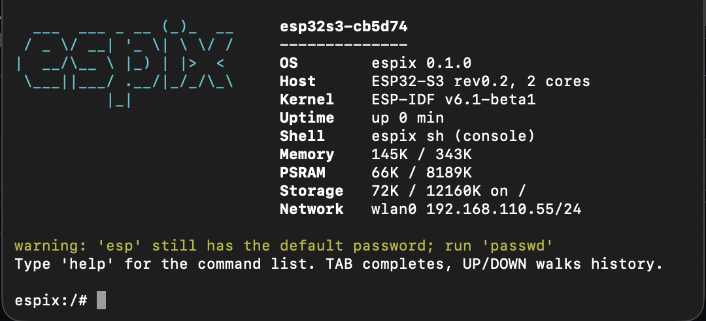

<p align="center">
  
</p>

# espix

A Unix(-like) kernel/runtime environment for ESP32, built on ESP-IDF.

espix aims to bring the parts of the Linux/Unix operational model that
are actually useful on a microcontroller — a real shell, a real
filesystem, real networking, and the ability to dynamically load and run
native apps — while leaving enough flash/RAM headroom for those apps to
actually do something. It intentionally does **not** try to be a
Linux-compatible kernel; the target is closer to a "nommu Linux"-style
environment purpose-built for ESP-IDF.

## Status

Early, but running on hardware. Verified on an ESP32-S3 (16MB flash,
8MB octal PSRAM) with ESP-IDF v6.1-beta1: LittleFS mounted as the real
`/`, a transport-agnostic shell with ~32 commands, a process table, and
— the point of the exercise — an app cross-compiled on a PC, deployed
as a file, and loaded and executed at runtime by the ELF loader, with
argv and an exit status. Files created on the device survive a reboot
and a firmware reflash.

Networking works: WiFi station comes up as `wlan0`, takes a DHCP lease,
installs a default route, and `ping` resolves names. On top of it runs an
SSH server, so `ssh esp@esp32s3-cb5d74` reaches the same shell the serial
console gets — same commands, same output, and an app's `printf()` lands
in the session that ran it rather than on the console. See
[First boot](#first-boot) to get there, and read
[the note on the SSH server](#a-word-on-the-ssh-server) before putting one
on an untrusted network.

Fault interception is wired but only *reports*; it does not yet keep the
system up (see [Crash Handling &
Isolation Model](#crash-handling--isolation-model)).

Design notes and the decisions behind the structure are in
[docs/ARCHITECTURE.md](docs/ARCHITECTURE.md).

## Goals

- A "real" kernel/supervisor layer on top of FreeRTOS + ESP-IDF, not
  just a shell bolted onto example code.
- A crashing app does not crash the system.
- A real filesystem with mutability and persistence (LittleFS).
- Real networking (WiFi / Ethernet / USB-NCM where supported).
- A shell, available over UART/USB, and over SSH on any IP network.
- SSH/SCP.
- Most common, useful POSIX-ish commands available.
- `top`/`htop`-style live view of tasks/apps and CPU/memory stats.
- **Cross-compile C apps on a PC, dynamically deploy and run them on the
  device** — this is the centerpiece feature. An ELF loader, not just
  statically linked-in firmware.
- More requirements will surface as the design matures.

## Non-goals (for now)

- Full Linux binary/ABI compatibility.
- Memory-protected process isolation on chips without an MMU (see
  [Crash Handling & Isolation Model](#crash-handling--isolation-model)).
- Being a drop-in replacement for Linux — this is a purpose-built
  environment, not an emulation layer.

## Why not just use ESP32OS / esp32-running-linux / Linux-on-esp32-S3?

espix is inspired by prior art in this space, but diverges enough in
architecture that it's being built as an independent project rather
than a fork:

- **[nodestark/esp32-running-linux](https://github.com/nodestark/esp32-running-linux)**
  and **[paulneja/Linux-on-esp32-S3](https://github.com/paulneja/Linux-on-esp32-S3)**
  — inspiration for the "why not just run something Linux-like on this
  chip" idea. Neither publishes clear numbers on flash/RAM headroom left
  for real applications after boot, which is the resource budget espix
  is explicitly designed around.
- **[faizannazir/Esp32OS](https://github.com/faizannazir/Esp32OS)** — a
  similar idea (FreeRTOS + ESP-IDF with a Linux-style shell, `ps`/`top`/
  `free`/`dmesg`, process management commands). Good prior art for shell
  ergonomics, but its "processes" are FreeRTOS tasks managed through a
  shell layer, it uses SPIFFS (LittleFS is only a roadmap item there),
  and it has no ELF loader or dynamic native app loading — which is
  espix's core requirement. Because that requirement implies a
  different architecture (loader, syscall boundary, LittleFS from day
  one) rather than incremental features, espix is being built fresh
  instead of forked. Esp32OS is MIT-licensed with attribution/branding
  requirements (see its `NOTICE.md` / `BRANDING_POLICY.md`); any code
  directly reused from it will retain its license notice and be
  credited here.

## Crash Handling & Isolation Model

espix does **not** provide MMU-based memory isolation between apps on
chips that lack a real MMU (S3, and P4 to a lesser extent — see
[Hardware Targets](#hardware-targets)). This is a deliberate, accepted
tradeoff, conceptually similar to nommu Linux: apps run in a shared
address space and are expected to be trusted, self-compiled code, not a
security sandbox for untrusted binaries.

What espix does today:

- A hook on the panic path (`-Wl,--wrap=esp_panic_handler`, the same
  seam ESP-IDF's own test suite uses) intercepts every fault —
  `LoadProhibited`, `StoreProhibited`, illegal instruction, watchdogs,
  aborts.
- It records the core, exception class, faulting address, task name and
  espix pid into memory that survives the reset, prints one line, and
  then delegates to the normal handler. The next boot reports the
  post-mortem on the console and in `dmesg`:

  ```
  espix: fault: previous boot: fault in task 'main' at 0x4200f226 (StoreProhibited), core 0
  ```

  The `crash` command triggers this on demand. `coredump` inspects the
  full dump ESP-IDF writes alongside it.

What it does **not** do yet — deliberately:

- Reap the faulting task and keep running. The reaper task and its
  queue exist (`espix_fault_request_reap()`), but nothing feeds them.
  Skipping the reboot is the easy half; the hard half is below, and
  shipping the easy half alone would produce a system that limps rather
  than one that recovers.
- Known limitations to design around rather than ignore:
  - It only catches invalid-memory-access faults, not general memory
    corruption (buffer overflows into valid memory, heap corruption,
    one task's wild write landing inside another task's stack or the
    kernel). Those go undetected, same as on nommu Linux.
  - Locks held by a reaped task (heap/malloc lock, VFS/filesystem
    mutex, driver mutexes) need explicit handling — timeout-based
    acquisition and/or per-app heap arenas — or a reaped task can wedge
    the rest of the system instead of just itself.
  - Stack overflow is treated as its own fault class; once it happens
    the task's stack contents can't be trusted, so recovery = reap, not
    "resume."
- Longer-term, the syscall/loader boundary should be designed to allow
  chips with a real MMU (S31) to eventually get actual MPU/MMU-backed
  process isolation as an opt-in, without requiring a rewrite. S3 stays
  in "catch and reap" mode regardless.

## Hardware Targets

| Chip | Notes |
|---|---|
| **S3** | Most common / oldest of the three targets. Typically 16/32MB external flash, 8/16MB PSRAM. Xtensa, no MMU. |
| **P4** | Best for "desktop"-style use — best display output (MIPI DSI, HDMI variant exists), can drive Ethernet (100M) and a screen simultaneously.  Weaker MMU than S31 (not enough for real Linux-style isolation). **No built-in WiFi/BT** — needs a companion chip (typically ESP32-C6) over SDIO/SPI for wireless. |
| **S31** | Latest ESP32. CPU 320mhz lower than the P4, but has higher per-MHz instruction efficiency. Has a real MMU. Gigabit Ethernet. Weaker/limited display output than P4. Cannot use Ethernet and a display at the same time (AFAIK). |

Support priority and per-chip feature availability (isolation model,
display, networking) still to be finalized as the design matures.

## Roadmap

1. ~~Switch filesystem to LittleFS.~~ Done — mounted as the real `/`.
2. ~~Integrate an ELF loader for dynamically loaded native apps.~~ Done
   via `espressif/elf_loader`, which covers all three target chips.
3. ~~Ship a working example of a cross-compiled app built on a PC and
   deployed/run on-device.~~ Done — [apps/hello](apps/hello), running
   on hardware with argv and an exit status.
4. Make a crashing app actually not crash the system (the reaper, held
   locks, per-process resource ownership).
5. ~~Networking, and a shell over it.~~ Done for WiFi: `wlan0` appears in
   `ip addr`, takes a DHCP lease, installs a default route, `ping` works
   by name and by address, and an SSH server serves the same shell as the
   console. Ethernet (P4/S31) and USB-NCM are still to come, as are
   SCP/SFTP and publickey authentication.
6. A reentrant line editor, replacing linenoise on both transports.
   linenoise reads and writes raw file descriptors and keeps its history
   and callbacks in file-scope statics, so it cannot serve a connection
   whose bytes arrive inside encrypted SSH packets — which is why an SSH
   session today has no history or tab completion.
7. `top`/`htop`-style live stats, a fuller command surface, pipes and
   job control.

## Building

Requires ESP-IDF v6.1 or newer.

```bash
. $IDF_PATH/export.sh
idf.py set-target esp32s3        # see Hardware Targets
idf.py build
idf.py -p <port> flash monitor
```

`idf.py flash` updates the firmware only. The filesystem is a separate
image, flashed explicitly — a plain firmware flash deliberately leaves
whatever is on the device alone:

```bash
idf.py -p <port> storage-flash   # WARNING: replaces the whole rootfs
```

To build and deploy an app, see [tools/README.md](tools/README.md).

Board assumptions live in
[sdkconfig.defaults.esp32s3](sdkconfig.defaults.esp32s3) (16MB flash,
8MB octal PSRAM) and [partitions.csv](partitions.csv) (4MB app,
11.9MB rootfs).

## First boot

Flash the firmware and the rootfs together the first time, then watch it
come up:

```bash
idf.py -p <port> flash storage-flash monitor
```

Boot prints kernel messages, then the console session prints the greeting at
the top of this README — with `Network` reading `not connected` until you
join one.

`help` lists every command; `motd` reprints that block at any time.

### Joining a WiFi network

Credentials live in `/etc/wifi.conf` on the rootfs. Set them once, from the
serial console:

```
espix:/# wifi connect <ssid> <passphrase>
```

That associates immediately *and* writes the file, so every later boot
reconnects on its own — retrying with a backoff, and giving up rather than
looping if the AP rejects the passphrase. `wifi status` shows where it got
to, `wifi scan` lists what is nearby, and `ip addr` / `route` report the
result. The file is plain `key=value` and editing it by hand does what you
would expect.

The hostname is derived from the MAC address — `esp32s3-cb5d74` — so it
matches what the device already announces over DHCP. `hostname <name>`
changes it.

### Logging in over SSH

`sshd` listens on port 22 from boot. Once `ip addr` shows an address:

```bash
ssh esp@esp32s3-cb5d74          # or the IP; .lan works if your router adds it
```

**The shipped account is `esp`, password `espix`.** Both the console and an
SSH session say so on every login until you change it:

```
espix:/# passwd esp <new-password>
```

Passwords are stored in `/etc/passwd` as PBKDF2-SHA256 with a per-user salt,
never in plaintext — unlike the WiFi passphrase, a login password is likely
reused somewhere else.

The host key is generated on first boot into `/etc/ssh/host_ecdsa_key`, and
its fingerprint is printed on the serial console so you can compare it
against what your client shows the first time it connects:

```
espix: sshkey: host key SHA256:Sts8sx9+JuATlAMgo/iW1qYjBTbel+wXeXb7E2V2xhg
```

One session at a time for now. The serial console stays independent, so you
can watch kernel messages there while working over SSH — `dmesg` is how a
remote user reads them, exactly as on Linux.

### A word on the SSH server

espix implements SSH itself rather than linking an existing one. The only
SSH server on the ESP component registry is GPL-or-commercial, which would
have forced the licence of any firmware image built on espix; mbed TLS was
already linked and its PSA Crypto API covers everything the protocol needs.

What that buys is one algorithm per role — `curve25519-sha256`,
`ecdsa-sha2-nistp256`, `aes256-ctr`, `hmac-sha2-256-etm@openssh.com` — with
the Terrapin (CVE-2023-48795) mitigation, and no negotiation logic to get
wrong. Password authentication only; no publickey, no SCP/SFTP, no rekeying,
so a session running for hours will eventually be dropped.

What it costs is stated plainly: **this is a hand-rolled implementation of a
security protocol and it has not been audited.** That is a reasonable trade
on a trusted LAN and a bad one facing the internet — do not port-forward it.
The host private key is also stored in plaintext on LittleFS, consistent
with espix's trusted-code model: anyone who can read the filesystem can
impersonate the device.

## License

MIT — see [LICENSE](LICENSE).

Any code directly incorporated from other MIT-licensed projects (e.g.
Esp32OS) retains its original license notice; see individual file
headers / a `NOTICE.md` once added. None is incorporated today —
`espressif/elf_loader` and `joltwallet/littlefs` are fetched at build
time by the IDF component manager rather than vendored into this tree.

## Acknowledgements

- [nodestark/esp32-running-linux](https://github.com/nodestark/esp32-running-linux)
- [paulneja/Linux-on-esp32-S3](https://github.com/paulneja/Linux-on-esp32-S3)
- [faizannazir/Esp32OS](https://github.com/faizannazir/Esp32OS)
- Espressif ESP-IDF / FreeRTOS
